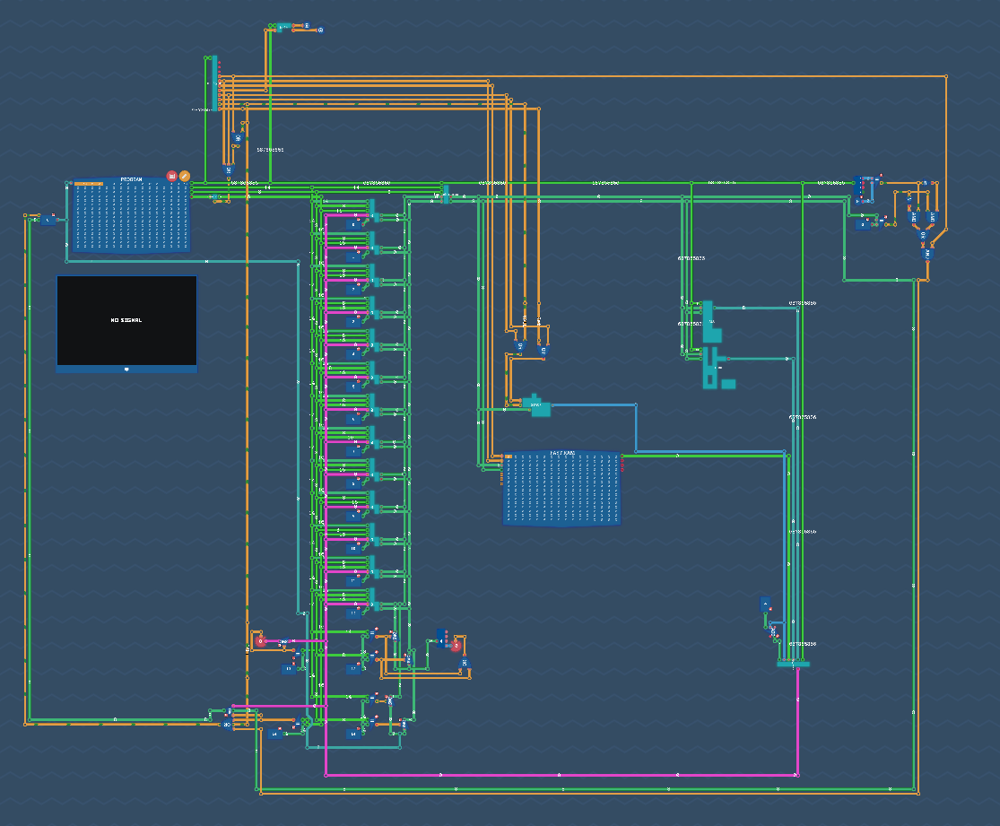

# PumpedS computer made in [Turing Complete](https://turingcomplete.game/)

I made a computer in turing complete with my own instruction set!

This repo contains:
- **/asm/levels** - Some sample ASM for solving some of the levels in the game
- **/compiler** - A compiler written in rust that compiles the ASM to machine code
- **/data** - A dump of the computer in the file format of turing complete
- **/docs** - The spec of the computer
